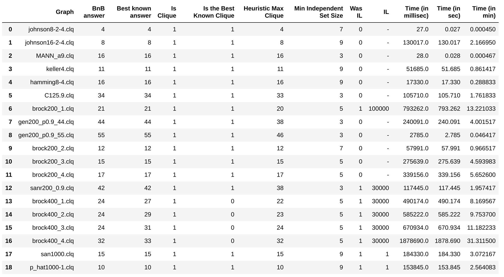

# Max Clique Problem
**!NEW**

|    | Graph              |   BnB answer |   Best known answer |   Is Clique |   Is the Best Known Clique |   Heuristic Max Clique |   Min Independent Set Size |   Was TL | TL (sec)   |   Time (in millisec) |   Time (in sec) |   Time (in min) |
|---:|:-------------------|-------------:|--------------------:|------------:|---------------------------:|-----------------------:|---------------------------:|---------:|:-----------|---------------------:|----------------:|----------------:|
|  0 | brock200_1.clq     |           21 |                  21 |           1 |                          1 |                     21 |                          5 |        1 | 3600       |          3.60003e+06 |        3600.03  |    60.0005      |
|  1 | brock200_2.clq     |           12 |                  12 |           1 |                          1 |                     12 |                          7 |        0 | -          |      57991           |          57.991 |     0.966517    |
|  2 | brock200_3.clq     |           15 |                  15 |           1 |                          1 |                     15 |                          5 |        0 | -          |     275639           |         275.639 |     4.59398     |
|  3 | brock200_4.clq     |           17 |                  17 |           1 |                          1 |                     17 |                          5 |        0 | -          |     339156           |         339.156 |     5.6526      |
|  4 | c-fat200-1.clq     |           12 |                  12 |           1 |                          1 |                     12 |                          9 |        0 | -          |       2505           |           2.505 |     0.04175     |
|  5 | c-fat200-2.clq     |           24 |                  24 |           1 |                          1 |                     24 |                          7 |        0 | -          |       2451           |           2.451 |     0.04085     |
|  6 | c-fat200-5.clq     |           58 |                  58 |           1 |                          1 |                     58 |                          3 |        0 | -          |       6384           |           6.384 |     0.1064      |
|  7 | c-fat500-1.clq     |           14 |                  14 |           1 |                          1 |                     14 |                          9 |        0 | -          |      84861           |          84.861 |     1.41435     |
|  8 | c-fat500-10.clq    |          126 |                 126 |           1 |                          1 |                    126 |                          3 |        0 | -          |     109632           |         109.632 |     1.8272      |
|  9 | c-fat500-2.clq     |           26 |                  26 |           1 |                          1 |                     26 |                          9 |        0 | -          |     113293           |         113.293 |     1.88822     |
| 10 | c-fat500-5.clq     |           64 |                  64 |           1 |                          1 |                     64 |                          7 |        0 | -          |      68946           |          68.946 |     1.1491      |
| 11 | C125.9.clq         |           34 |                  34 |           1 |                          1 |                     33 |                          3 |        0 | -          |     105710           |         105.71  |     1.76183     |
| 12 | gen200_p0.9_44.clq |           44 |                  44 |           1 |                          1 |                     38 |                          3 |        0 | -          |     240091           |         240.091 |     4.00152     |
| 13 | gen200_p0.9_55.clq |           55 |                  55 |           1 |                          1 |                     46 |                          3 |        0 | -          |       2785           |           2.785 |     0.0464167   |
| 14 | johnson8-2-4.clq   |            4 |                   4 |           1 |                          1 |                      4 |                          7 |        0 | -          |         27           |           0.027 |     0.00045     |
| 15 | johnson8-4-4.clq   |           14 |                  14 |           1 |                          1 |                     14 |                          5 |        0 | -          |         87           |           0.087 |     0.00145     |
| 16 | johnson16-2-4.clq  |            8 |                   8 |           1 |                          1 |                      8 |                          9 |        0 | -          |     130017           |         130.017 |     2.16695     |
| 17 | hamming6-2.clq     |           32 |                  32 |           1 |                          1 |                     32 |                          3 |        0 | -          |         67           |           0.067 |     0.00111667  |
| 18 | hamming6-4.clq     |            4 |                   4 |           1 |                          1 |                      4 |                          9 |        0 | -          |        185           |           0.185 |     0.00308333  |
| 19 | hamming8-2.clq     |          128 |                 128 |           1 |                          1 |                    128 |                          3 |        0 | -          |       7945           |           7.945 |     0.132417    |
| 20 | hamming8-4.clq     |           16 |                  16 |           1 |                          1 |                     16 |                          9 |        0 | -          |      17330           |          17.33  |     0.288833    |
| 21 | keller4.clq        |           11 |                  11 |           1 |                          1 |                     11 |                          9 |        0 | -          |      51685           |          51.685 |     0.861417    |
| 22 | MANN_a9.clq        |           16 |                  16 |           1 |                          1 |                     16 |                          3 |        0 | -          |         28           |           0.028 |     0.000466667 |
| 23 | MANN_a27.clq       |          126 |                 126 |           1 |                          1 |                    125 |                          3 |        1 | 3600       |          3.60001e+06 |        3600.01  |    60.0002      |
| 24 | MANN_a45.clq       |          342 |                 345 |           1 |                          0 |                    339 |                          3 |        1 | 3600       |          3.60002e+06 |        3600.02  |    60.0003      |
| 25 | p_hat300-1.clq     |            8 |                   8 |           1 |                          1 |                      8 |                          9 |        0 | -          |     207920           |         207.92  |     3.46533     |
| 26 | p_hat300-2.clq     |           25 |                  25 |           1 |                          1 |                     24 |                          9 |        1 | 3600       |          3.60002e+06 |        3600.02  |    60.0003      |
| 27 | p_hat300-3.clq     |           34 |                  36 |           1 |                          0 |                     32 |                          5 |        1 | 3600       |          3.60002e+06 |        3600.02  |    60.0003      |
| 28 | san200_0.7_1.clq   |           30 |                  30 |           1 |                          1 |                     30 |                          5 |        0 | -          |       2875           |           2.875 |     0.0479167   |
| 29 | san200_0.7_2.clq   |           18 |                  18 |           1 |                          1 |                     16 |                          7 |        0 | -          |     149849           |         149.849 |     2.49748     |
| 30 | san200_0.9_1.clq   |           70 |                  70 |           1 |                          1 |                     70 |                          3 |        0 | -          |       2913           |           2.913 |     0.04855     |
| 31 | san200_0.9_2.clq   |           60 |                  60 |           1 |                          1 |                     58 |                          3 |        0 | -          |       2697           |           2.697 |     0.04495     |
| 32 | san200_0.9_3.clq   |           37 |                  44 |           1 |                          0 |                     36 |                          3 |        1 | 3600       |          3.60001e+06 |        3600.01  |    60.0002      |
| 33 | sanr200_0.7.clq    |           18 |                  18 |           1 |                          1 |                     17 |                          5 |        0 | -          |     924788           |         924.788 |    15.4131      |
Характеристики машины:
```
Intel(R) Core(TM) i7-9750H CPU @ 2.60GHz;
```
Ставились ограничения на кол-во заходов в BnB (IL: лимит на итерации) для "сложных" графов.

Сложность графов: E - easy, M - middle, H - hard.

Результаты (IL небольшие, чтобы долго не ждать; время приведено в трех форматах: в миллисекундах, в секундах, в минутах):


_main.cpp_ считывает из _info.csv_ графы, которые надо обработать, и записывает результат в _result.csv_.

Формат _info.csv_:
```
Filename,Best known,Type
,,,
johnson8-2-4,4,E
johnson16-2-4,8,E
MANN_a9,16,E
keller4,11,E
hamming8-4,16,E
//
```
Формат _result.csv_:
```
is_clique,is_best_known,graph,time,bnb_sol,best_known,heuristic_clique,was_IL,min_independent_set_size
```

Логи:
```
Filename: brock200_2.clq
No edges: 10024
Independent sets size 2: 0
Found independent sets (+ size 2): 4273
No edges: 10024
Independent sets size 2: 0
Found independent sets (+ size 2): 3559
No edges: 10024
Independent sets size 2: 67
Found independent sets (+ size 2): 2189
No edges: 10024
Independent sets size 2: 7908
Found independent sets (+ size 2): 7986
Min independent set size: 7
Independent sets: 2189
Initial max clique size: 12
Time: 57991; 0; 12; 12

Filename: brock200_3.clq
No edges: 7852
Independent sets size 2: 0
Found independent sets (+ size 2): 4135
No edges: 7852
Independent sets size 2: 1
Found independent sets (+ size 2): 2964
No edges: 7852
Independent sets size 2: 4503
Found independent sets (+ size 2): 4782
No edges: 7852
Independent sets size 2: 7852
Found independent sets (+ size 2): 7852
Min independent set size: 5
Independent sets: 2964
Initial max clique size: 15
Time: 275639; 0; 15; 15

Filename: brock200_4.clq
No edges: 6811
Independent sets size 2: 0
Found independent sets (+ size 2): 3864
No edges: 6811
Independent sets size 2: 20
Found independent sets (+ size 2): 2442
No edges: 6811
Independent sets size 2: 6270
Found independent sets (+ size 2): 6302
No edges: 6811
Independent sets size 2: 6811
Found independent sets (+ size 2): 6811
Min independent set size: 5
Independent sets: 2442
Initial max clique size: 17
Time: 339156; 0; 17; 17


Process finished with exit code 0


Filename: johnson8-2-4.clq
No edges: 168
Independent sets size 2: 0
Found independent sets (+ size 2): 68
No edges: 168
Independent sets size 2: 0
Found independent sets (+ size 2): 28
No edges: 168
Independent sets size 2: 0
Found independent sets (+ size 2): 8
No edges: 168
Independent sets size 2: 168
Found independent sets (+ size 2): 168
Min independent set size: 7
Independent sets: 8
Initial max clique size: 4
Time: 27; 0; 4; 4

Filename: johnson16-2-4.clq
No edges: 1680
Independent sets size 2: 0
Found independent sets (+ size 2): 341
No edges: 1680
Independent sets size 2: 0
Found independent sets (+ size 2): 129
No edges: 1680
Independent sets size 2: 0
Found independent sets (+ size 2): 124
No edges: 1680
Independent sets size 2: 0
Found independent sets (+ size 2): 114
Min independent set size: 9
Independent sets: 114
Initial max clique size: 8
Time: 130017; 0; 8; 8

Filename: MANN_a9.clq
No edges: 72
Independent sets size 2: 36
Found independent sets (+ size 2): 48
No edges: 72
Independent sets size 2: 72
Found independent sets (+ size 2): 72
No edges: 72
Independent sets size 2: 72
Found independent sets (+ size 2): 72
No edges: 72
Independent sets size 2: 72
Found independent sets (+ size 2): 72
Min independent set size: 3
Independent sets: 48
Initial max clique size: 16
Time: 28; 0; 16; 16

Filename: keller4.clq
No edges: 5100
Independent sets size 2: 0
Found independent sets (+ size 2): 2064
No edges: 5100
Independent sets size 2: 1
Found independent sets (+ size 2): 1633
No edges: 5100
Independent sets size 2: 114
Found independent sets (+ size 2): 1175
No edges: 5100
Independent sets size 2: 392
Found independent sets (+ size 2): 965
Min independent set size: 9
Independent sets: 965
Initial max clique size: 11
Time: 51685; 0; 11; 11

Filename: hamming8-4.clq
No edges: 11776
Independent sets size 2: 0
Found independent sets (+ size 2): 3882
No edges: 11776
Independent sets size 2: 0
Found independent sets (+ size 2): 3399
No edges: 11776
Independent sets size 2: 0
Found independent sets (+ size 2): 2459
No edges: 11776
Independent sets size 2: 0
Found independent sets (+ size 2): 1662
Min independent set size: 9
Independent sets: 1662
Initial max clique size: 16
Time: 17330; 0; 16; 16


Process finished with exit code 0


Filename: C125.9.clq
No edges: 787
Independent sets size 2: 219
Found independent sets (+ size 2): 519
No edges: 787
Independent sets size 2: 787
Found independent sets (+ size 2): 787
No edges: 787
Independent sets size 2: 787
Found independent sets (+ size 2): 787
No edges: 787
Independent sets size 2: 787
Found independent sets (+ size 2): 787
Min independent set size: 3
Independent sets: 519
Initial max clique size: 33
Time: 105710; 0; 34; 34

Filename: brock200_1.clq
No edges: 5066
Independent sets size 2: 0
Found independent sets (+ size 2): 3281
No edges: 5066
Independent sets size 2: 1316
Found independent sets (+ size 2): 2274
No edges: 5066
Independent sets size 2: 5066
Found independent sets (+ size 2): 5066
No edges: 5066
Independent sets size 2: 5066
Found independent sets (+ size 2): 5066
Min independent set size: 5
Independent sets: 2274
Initial max clique size: 20
Time: 793262; 1; 21; 21


Process finished with exit code 0


Filename: gen200_p0.9_44.clq
No edges: 1990
Independent sets size 2: 225
Found independent sets (+ size 2): 1236
No edges: 1990
Independent sets size 2: 1746
Found independent sets (+ size 2): 1771
No edges: 1990
Independent sets size 2: 1990
Found independent sets (+ size 2): 1990
No edges: 1990
Independent sets size 2: 1990
Found independent sets (+ size 2): 1990
Min independent set size: 3
Independent sets: 1236
Initial max clique size: 38
Time: 240091; 0; 44; 44

Filename: gen200_p0.9_55.clq
No edges: 1990
Independent sets size 2: 254
Found independent sets (+ size 2): 1266
No edges: 1990
Independent sets size 2: 1980
Found independent sets (+ size 2): 1981
No edges: 1990
Independent sets size 2: 1990
Found independent sets (+ size 2): 1990
No edges: 1990
Independent sets size 2: 1990
Found independent sets (+ size 2): 1990
Min independent set size: 3
Independent sets: 1266
Initial max clique size: 46
Time: 2785; 0; 55; 55


Process finished with exit code 0


Filename: sanr200_0.9.clq
No edges: 2037
Independent sets size 2: 274
Found independent sets (+ size 2): 1333
No edges: 2037
Independent sets size 2: 2037
Found independent sets (+ size 2): 2037
No edges: 2037
Independent sets size 2: 2037
Found independent sets (+ size 2): 2037
No edges: 2037
Independent sets size 2: 2037
Found independent sets (+ size 2): 2037
Min independent set size: 3
Independent sets: 1333
Initial max clique size: 38
Time: 117445; 1; 42; 42


Process finished with exit code 0


Filename: brock400_1.clq
No edges: 20077
Independent sets size 2: 0
Found independent sets (+ size 2): 12420
No edges: 20077
Independent sets size 2: 379
Found independent sets (+ size 2): 7175
No edges: 20077
Independent sets size 2: 19870
Found independent sets (+ size 2): 19880
No edges: 20077
Independent sets size 2: 20077
Found independent sets (+ size 2): 20077
Min independent set size: 5
Independent sets: 7175
Initial max clique size: 22
Time: 490174; 1; 24; 27

Filename: brock400_2.clq
No edges: 20014
Independent sets size 2: 0
Found independent sets (+ size 2): 12373
No edges: 20014
Independent sets size 2: 418
Found independent sets (+ size 2): 7110
No edges: 20014
Independent sets size 2: 19930
Found independent sets (+ size 2): 19934
No edges: 20014
Independent sets size 2: 20014
Found independent sets (+ size 2): 20014
Min independent set size: 5
Independent sets: 7110
Initial max clique size: 23
Time: 585222; 1; 24; 29

Filename: brock400_3.clq
No edges: 20119
Independent sets size 2: 0
Found independent sets (+ size 2): 12485
No edges: 20119
Independent sets size 2: 392
Found independent sets (+ size 2): 7167
No edges: 20119
Independent sets size 2: 19972
Found independent sets (+ size 2): 19979
No edges: 20119
Independent sets size 2: 20119
Found independent sets (+ size 2): 20119
Min independent set size: 5
Independent sets: 7167
Initial max clique size: 24
Time: 670934; 1; 24; 31

Filename: brock400_4.clq
No edges: 20035
Independent sets size 2: 0
Found independent sets (+ size 2): 12318
No edges: 20035
Independent sets size 2: 403
Found independent sets (+ size 2): 7192
No edges: 20035
Independent sets size 2: 19808
Found independent sets (+ size 2): 19821
No edges: 20035
Independent sets size 2: 20035
Found independent sets (+ size 2): 20035
Min independent set size: 5
Independent sets: 7192
Initial max clique size: 32
Time: 1.87869e+06; 1; 32; 33


Process finished with exit code 0


Filename: san1000.clq
No edges: 249000
Independent sets size 2: 0
Found independent sets (+ size 2): 32468
No edges: 249000
Independent sets size 2: 0
Found independent sets (+ size 2): 32128
No edges: 249000
Independent sets size 2: 0
Found independent sets (+ size 2): 31238
No edges: 249000
Independent sets size 2: 0
Found independent sets (+ size 2): 29773
Min independent set size: 9
Independent sets: 29773
Initial max clique size: 15
Time: 184330; 1; 15; 15

Filename: p_hat1000-1.clq
No edges: 377247
Independent sets size 2: 0
Found independent sets (+ size 2): 67134
No edges: 377247
Independent sets size 2: 0
Found independent sets (+ size 2): 65470
No edges: 377247
Independent sets size 2: 0
Found independent sets (+ size 2): 60221
No edges: 377247
Independent sets size 2: 0
Found independent sets (+ size 2): 55084
Min independent set size: 9
Independent sets: 55084
Initial max clique size: 10
Time: 153845; 1; 10; 10


Process finished with exit code 0

```
